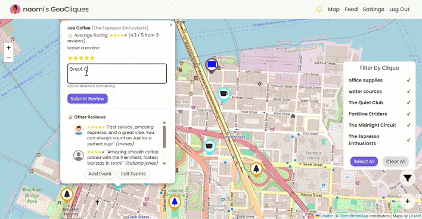

# GeoCliques


**GeoCliques** is a social, map-based web application where users can create and join "cliques" (groups), place markers on a map, leave reviews and events, and collaborate in a dynamic geospatial environment. The app includes user authentication, interactive mapping with custom icons, notifications, multi-layer map support, and full admin control over user content.

> 🎓 This application was originally co-developed as a 2025 joint academic capstone project. This repository represents my independent, refactored fork.

<div align="center">
  
</div>

## 🎯 Motivation

### The Problem
Discovering and sharing trusted locations is currently a fragmented experience.

* **Scattered Data:** Location recommendations are lost across various social media feeds and messaging apps.
* **Inadequate Group Tools:** Friend groups and niche communities lack a centralized, private, and easy way to curate and discover trusted places together.
* **Unscalable Discovery:** Traditional word-of-mouth recommendations aren't easily searchable or scalable as a community grows.

### The Solution
This platform bridges that gap by providing a dedicated, map-based hub built specifically for location sharing.

* **Centralized Discovery:** Replaces scattered text messages with a single, interactive geospatial interface, making it seamless to find and mark locations.
* **Custom "Cliques":** Directly solves the lack of group tools by allowing users to create public, protected, or strictly private groups, keeping maps exclusive to the right users.
* **Scalable & Safe:** As communities grow, content created within cliques is strictly moderated by clique admins, ensuring the shared map remains organized, authentic, and free of spam.

## ✨ Key Features

- **Interactive Map**: Add markers, view reviews, and schedule events directly on a Leaflet.js map.
- **Dynamic Map Filtering**: Toggle the visibility of specific cliques to show or hide their associated markers on the map in real time.
- **Cliques System**: Create, join, or manage public, protected, and private cliques.
- **Review System**: Leave star ratings and optional commentary for each marker.
- **Event Scheduling**: Plan and view events tied to specific locations.
- **Notifications**: Receive and manage invitations, join requests, bans, and kicks.
- **Admin Control Room**: Manage clique membership, review content, and moderate user activities.
- **Custom Styling**: Dynamic marker icons, color-coded cliques, modern UI/UX styling.
- **Map Layers**: Switch between multiple map providers (OpenStreetMap, Esri Satellite, Thunderforest).

## 💻 Tech Stack

* **Backend:** Flask (App Factory, Blueprints) & SQLAlchemy 2.0 (ORM)
* **Frontend:** Vanilla JavaScript, Bootstrap & Jinja2 (Server-side rendering)
* **Database:** PostgreSQL 17 (via Docker Compose)
* **Mapping Engine:** Leaflet.js (Open-source interactive maps)
* **Security & Search:** Werkzeug (Cryptographic hashing) & RapidFuzz (Fuzzy string matching)
* **Testing:** Pytest (In-memory SQLite isolation)

## 🚀 Getting Started

Follow these steps to set up and run the project locally.

### 1. Clone the Repository
```bash
git clone https://github.com/ely142/geocliques-webapp.git
cd geocliques-webapp
```
### 2. Set Up Virtual Environment
Create a virtual environment to isolate dependencies from the global Python environment.

**On WSL / Linux / macOS:**
```bash
python3 -m venv venv
source venv/bin/activate
```

**On Windows:**
```bash
python -m venv venv
venv\Scripts\activate
```
### 3. Install Dependencies

Install the required packages listed in requirements.txt:
```bash
pip install -r requirements.txt
```
### 4. Configure Environment Variables

Create a `.env` file in the root directory.

> 💡Note: The .env file is listed in .gitignore to prevent sensitive keys from being pushed to the repository. You must create this file manually.

Add the following keys to your `.env` file:
```bash
FLASK_APP=run.py
FLASK_DEBUG=1
SECRET_KEY="your_super_secret_key_here"
DATABASE_URL="sqlite:///users.db" # Optional: Defaults to this SQLite path if left blank

# Optional: Third-Party Integrations
MAP_THUNDERFOREST_KEY="your_api_key_here" # Enables Thunderforest map tile layers
```
### 5. Run the Application

Execute `run.py` to start the server. This entry point establishes the Application Factory context, automatically generating the local SQLite database and its tables on the first run.

**On WSL / Linux / macOS:**
```bash
python3 run.py
```

**On Windows:**
```bash
python run.py
```
The application will now be running on http://127.0.0.1:5000.

## 🧪 Testing

The application utilizes `pytest` for optional local testing. If you wish to verify the application state, execute:
```bash
pytest -v
```
> 💡Note: To protect your local data, the test suite automatically routes all operations to an isolated, in-memory SQLite database, guaranteeing complete separation from your development environment.

## 📂 Folder Structure

```
geocliques-webapp/
├── app/                     # Core application package
│   ├── __init__.py          # Application Factory & Blueprint registration
│   ├── extensions.py        # Decoupled Flask extensions (db, login_manager)
│   ├── models.py            # SQLAlchemy ORM models
│   ├── utils.py             # Shared helper functions
│   ├── static/              # Frontend web assets (css, js, assets)
│   ├── templates/           # Domain-isolated HTML templates
│   │   ├── layout/          # Shared structural wrappers (e.g., base.html)
│   │   ├── auth/            # Authentication presentation layer
│   │   ├── map/             # Mapping presentation layer
│   │   └── .../             # Additional namespaces (mirrors blueprint packages)
│   │ 
│   # --- Blueprint Packages ---
│   ├── auth/                # Authentication
│   ├── clique/              # Clique management & admin controls
│   ├── event/               # Event processing
│   ├── main/                # Core routing (index, root, feed)
│   ├── map/                 # Map visualization, markers, and reviews
│   ├── master/              # Developer platform management dashboard
│   ├── notif/               # System notifications
│   └── user/                # User profile & settings
│                            # Note: All blueprint directories contain a standard 
│                            # __init__.py (registration) and routes.py (endpoints)
├── instance/                # Local SQLite database (gitignored)
├── tests/                   # Pytest testing suite
│   ├── conftest.py          # Test fixtures & isolated in-memory SQLite setup
│   └── test_*.py            # Domain-specific route and logic verification
├── run.py                   # Application entry point & context initialization
├── .env                     # Environment variables (gitignored)
├── requirements.txt         # Python dependencies
├── pyproject.toml           # Linter configuration
├── pytest.ini               # Pytest execution configuration
├── .gitignore               # Untracked files and directories
└── README.md                # Project documentation
```

## ⚙️ Architecture & Technical Decisions

* **Application Factory Architecture:** Core application instantiation is handled via a Flask Application Factory pattern to eliminate circular dependencies. Routing and state logic are decoupled into isolated domain Blueprints, establishing a modular foundation that supports separation of concerns. Additionally, UI templates are domain-namespaced to mirror this structure, while being maintained in a centralized directory to preserve clean inheritance and shared layouts.

* **Internal Developer Tooling:** A protected administrative dashboard was implemented to decouple internal platform operations from the user-facing web app, providing developers with a secure GUI for data management and content moderation without requiring direct database access.

* **Client-Side State Management:** Map marker filtering by clique is handled natively on the frontend via Leaflet's `L.geoJSON`. By transferring the full data payload to the browser, redundant database queries are eliminated, resulting in instantaneous UI updates via local DOM manipulation.

* **Explicit Database Associations:** Complex ternary relationships (e.g., User, Marker, Clique) are managed via a normalized SQLAlchemy schema using explicit association models. This allows contextual metadata to be stored directly on the join models, enabling highly efficient querying while eliminating complex multi-table joins.

## 🚧 Development Roadmap
This repository serves as a stable, functional baseline. Updates are pushed iteratively as new architectural patterns are evaluated.

**Active areas of exploration:**
* **Query Optimization:** Refactoring ORM queries to resolve N+1 bottlenecks and speed up data retrieval.
* **AI Integration:** Integrating AI capabilities for intelligent platform features.
* **Database Scaling:** Migrating infrastructure from SQLite to PostgreSQL.
* **Map Infrastructure:** Transitioning to keyless, open-source map tile providers.
* **Code Quality:** Enforcing strict Python type-safety and modern linting.
